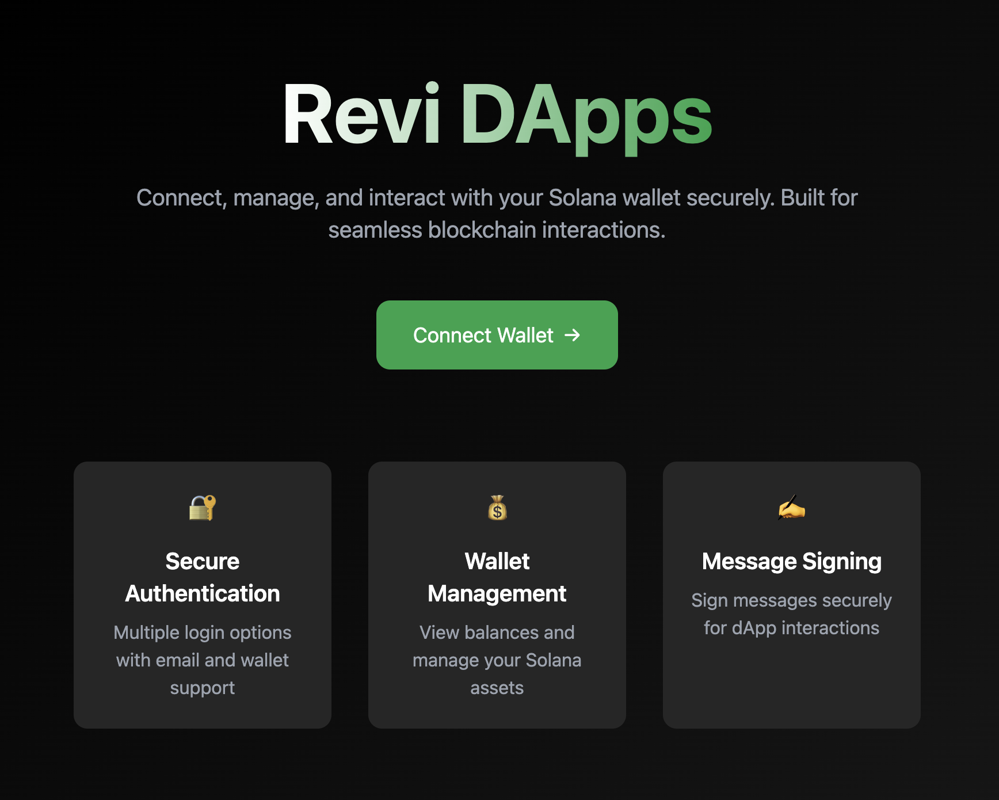

# Revi DApps – Secure Solana Wallet Interface

<p align="center">
  
</p>

## Product Overview

Revi DApps is a modern web application that enables users to securely connect, authenticate, and interact with their Solana wallets. Built for seamless onboarding, it leverages Privy Auth for authentication and supports both email and wallet-based login. Users can view wallet balances, sign messages, and manage their Solana accounts—all in a sleek, user-friendly interface.

### Key Features
- **Solana Wallet Integration:** Connect and manage Solana wallets with Privy Auth.
- **Multi-Method Login:** Authenticate using email or wallet for flexible onboarding.
- **Balance Display:** Instantly view your SOL balance after connecting.
- **Message Signing:** Sign custom messages with your Solana wallet for dApp interactions or verification.
- **Modern UI:** Responsive, accessible, and visually appealing design.

## Tech Stack
- **React 18** for UI
- **Vite** for fast development and build
- **Privy Auth** (`@privy-io/react-auth`) for authentication
- **Solana Web3.js** for blockchain interactions
- **Alchemy** (optional) for enhanced Solana RPC endpoints

## Getting Started

### 1. Clone the repository
```sh
git clone <your-repo-url>
cd revi-dapps-fe
```

### 2. Install dependencies
```sh
npm install
```

### 3. Configure environment variables
Copy the example environment file and fill in your credentials:
```sh
cp .env.example .env
```
- Get your Privy App ID from the [Privy Console](https://docs.privy.io/guide/console/api-keys) and set it in `.env`.
- Optionally, set your Alchemy API key for Solana RPC.

### 4. Run the app locally
```sh
npm run dev
```
Visit [http://localhost:5173](http://localhost:5173) to use the app.

## Project Structure & Key Files
- `src/index.jsx`: App entry point, PrivyProvider setup, Solana config
- `src/App.jsx`: Main UI, wallet connection, balance, and message signing logic
- `src/animations.css`, `src/App.css`, `src/index.css`: Styling and UI animations
- `.env.example`: Reference for required environment variables

## Extending & Contributing
- Add new Solana features by extending `src/App.jsx`.
- UI improvements can be made in the CSS files.
- For authentication or wallet logic, see Privy and Solana Web3.js docs.

## Resources
- [Privy Documentation](https://docs.privy.io/)
- [Solana Web3.js](https://solana-labs.github.io/solana-web3.js/)
- [Vite Documentation](https://vitejs.dev/)

---

*This project is for demonstration and rapid prototyping. For production, review security and best practices for wallet management and authentication.*
